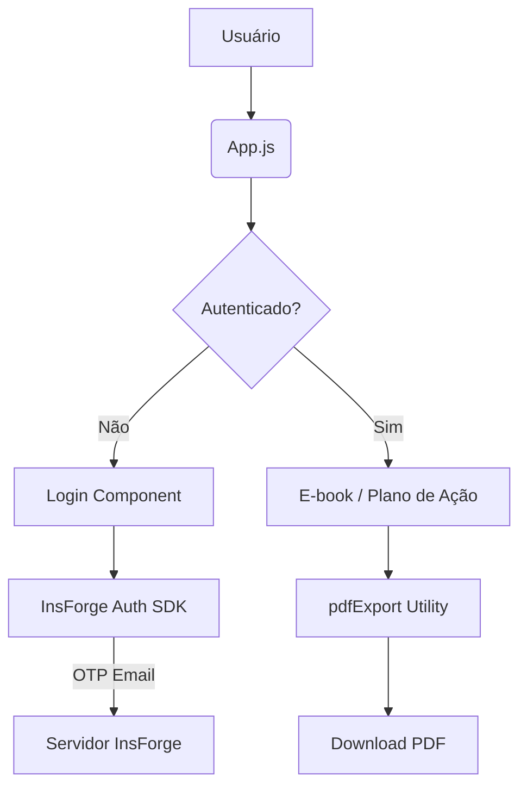

# Arquitetura do Projeto: Visão 360

O projeto **Visão 360** (antigo "Projeto Problemas Avil") é um ecossistema digital para gestores de varejo e atacado, focado em transformar a operação em estratégia nos primeiros 90 dias de gestão.

## Stack Tecnológica

- **Frontend:** React 19 (Vite)
- **Estilização:** TailwindCSS 4 + DaisyUI (Temas modernos, OKLCH colors)
- **Ícones:** Lucide React
- **Backend/Auth:** InsForge SDK (Auth, Database, Storage)
- **PWA:** `vite-plugin-pwa` para suporte a instalação mobile e cache offline.
- **PDF Export:** `jspdf` + `modern-screenshot` (Motor V3 Robust Edition).

## Estrutura de Pastas

```text
/
├── docs/               # Documentação técnica detalhada
├── public/             # Ativos estáticos públicos (logo.jpeg, manifest, ícones)
├── src/
│   ├── components/     # Componentes React reutilizáveis (Login, UserProfile, EbookReader)
│   ├── contexts/       # Contextos (AuthContext)
│   ├── lib/            # Clientes de integração (insforge.js)
│   ├── utils/          # Funções auxiliares (pdfExport.js)
│   ├── App.jsx         # Orquestrador principal da aplicação
│   ├── main.jsx        # Ponto de entrada (React + Providers)
│   └── index.css       # Estilos globais e tokens de design (avil-blue, avil-orange)
├── AGENTS.md           # Guia de diretrizes para assistentes de IA (Engenheiro de Software)
└── vite.config.js      # Configurações de build e plugin PWA
```

## Fluxo de Dados e Autenticação



## Diretrizes de Design

O projeto utiliza um sistema de cores personalizado baseado na marca AVIL:
- **AVIL Blue:** `#004a99` (Principal)
- **AVIL Orange:** `#f58220` (Destaque/Accent)
- **Tipografia:** Integrou-se o uso de fontes sem-serifa modernas (Sans-serif) para legibilidade profissional.
- **Glassmorphism:** Aplicado em menus e overlays para um visual "Premium Tech".
