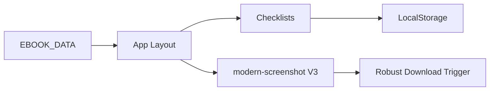

# Guia de Onboarding

Este guia foi desenhado para colocar desenvolvedores (humanos ou IAs) no controle total do código em tempo recorde.

## 🏆 Principal-Level Guide (TL;DR)

**Core Insight:** O app é um "Leitor Gerador". Ele consome um dataset estático (`EBOOK_DATA` em `App.jsx`) e permite que o usuário interaja marcando tarefas que persistem no `localStorage`. A inteligência do app não está na lógica de dados complexa, mas na **fidelidade visual e experiência de exportação**.

### Diagrama de Fluxo Principal (Mermaid)

### Design Trade-offs
- **Client-Side First:** Toda a lógica de progresso é mantida no cliente para velocidade instantânea. O Auth do InsForge é a única ponte externa real.
- **Atomic Components:** Os componentes são mantidos pequenos e especialistas (ex: `UserProfile`).

---

## 🚀 Zero-to-Hero Path

### Parte I: Fundamentos
- **Framework:** React 19. Familiarize-se com Hooks (`useState`, `useEffect`, `useRef`).
- **Estilo:** TailwindCSS 4. Usamos tokens customizados definidos no `index.css`.
- **Auth:** InsForge. Olhe `src/lib/insforge.js` para ver a inicialização.

### Parte II: Configuração Dev
1. Clone o repositório.
2. Instale dependências: `npm install`.
3. Configure o `.env` (chaves InsForge).
4. Rode: `npm run dev`.

### Parte III: Navegando no Código
- Quer mudar o conteúdo do livro? Vá direto no array `EBOOK_DATA` em `App.jsx`.
- Quer ajustar o Login? Edite `src/components/Login.jsx`.
- Problemas no PDF? O culpado quase sempre é `src/utils/pdfExport.js`.

### Glossário Essencial
- **V3 Robust Edition:** Nossa versão estável de exportação de PDF.
- **Modo Task:** A visão de Plano de Ação interativo.
- **Hard Reload:** `CMD + Shift + R`. Essencial quando o PDF mantiver nomes antigos (UUID).
